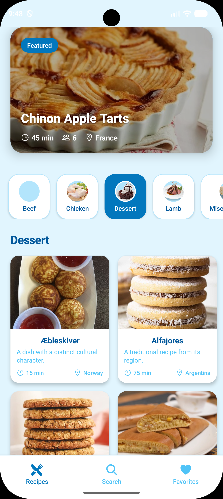
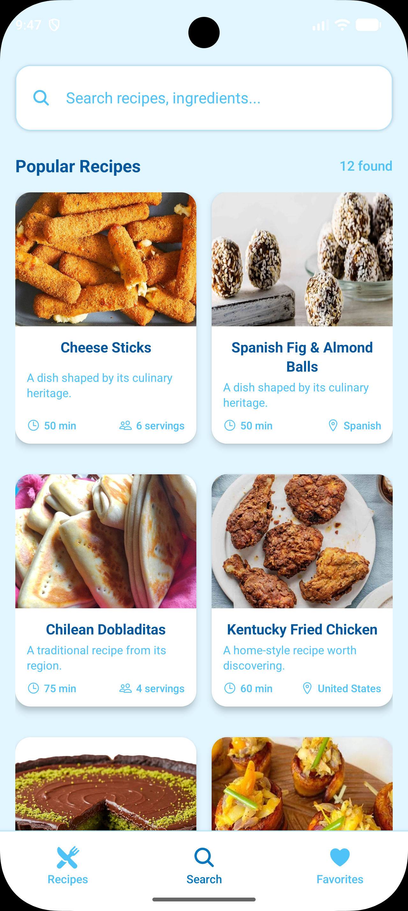
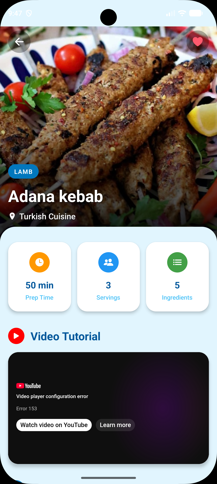
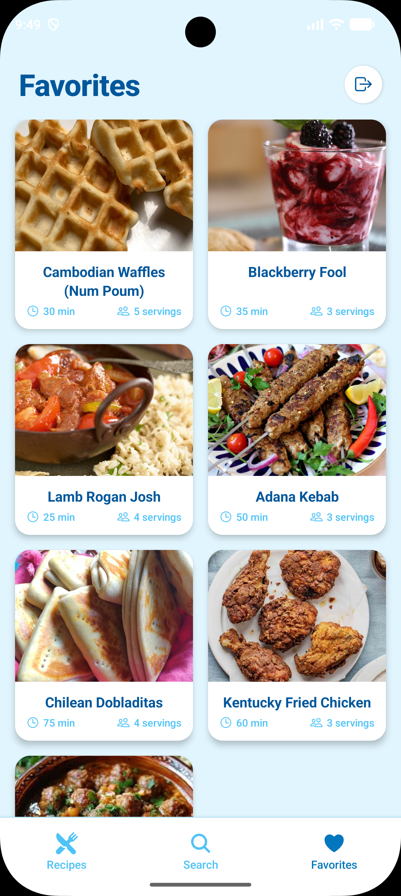
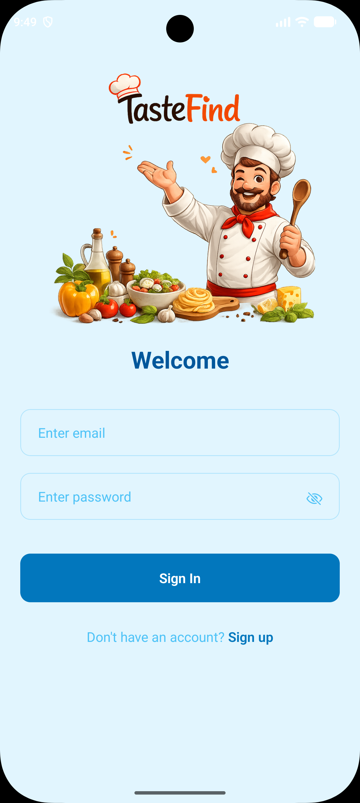
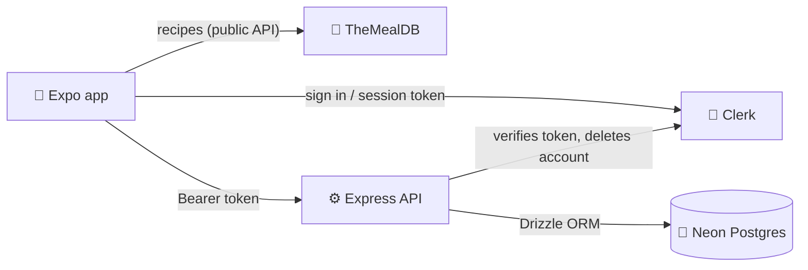

# 🍽️ TasteFind

**Discover recipes, search by ingredient, and save your favorites.**
A cross-platform mobile app built with Expo (React Native), a secured Express API, Postgres and Clerk authentication.


<table>
  <tr>
    <td align="center"><br><sub><b>Home</b></sub></td>
    <td align="center"><br><sub><b>Search</b></sub></td>
    <td align="center"><br><sub><b>Recipe details</b></sub></td>
    <td align="center"><br><sub><b>Favorites</b></sub></td>
    <td align="center"><br><sub><b>Sign in</b></sub></td>
  </tr>
</table>

## ✨ Features

- **Authentication**: email/password sign-up with email verification, sign-in, optional second factor (Clerk)
- **Home feed**: category filter that keeps its scroll position, featured recipe, pull-to-refresh
- **Search**: by recipe name or ingredient, debounced as you type
- **Recipe details**: ingredients, checkable cooking steps, embedded YouTube tutorial
- **Favorites**: saved per account and synced through the backend, removable from the recipe page
- **Account**: sign out and in-app account deletion (removes your data and your Clerk account)
- **Resilience**: request timeouts, retry screens, a global error boundary

> Prep time, servings and the short card description are **generated** from the recipe id, because TheMealDB does not provide them.

## 🧱 Tech stack

| Layer | Tools |
| --- | --- |
| Mobile | Expo SDK 54, expo-router (Stack + Tabs), React Native, expo-image, `@clerk/clerk-expo`, react-native-webview |
| Backend | Node.js (ESM), Express 5, Drizzle ORM, Neon Postgres, `@clerk/express`, helmet, express-rate-limit |
| Quality | `node:test`, ESLint (`eslint-config-expo`), GitHub Actions |

## 🏗️ Architecture



- Recipes are fetched straight from TheMealDB; **only favorites** touch the backend.
- The user id is read **only** from the verified Clerk session token. Ids in the URL or body are never trusted, so one user cannot read or change another user's data.

## 🚀 Getting started

You need your own free accounts for **[Clerk](https://clerk.com)** and **[Neon](https://neon.tech)**.

1. **Clerk**: create an application, enable **Email** and **Password** sign-in, copy the publishable key and secret key from *API Keys*.
2. **Neon**: create a Postgres project and copy the connection string.

### Backend
```bash
cd backend
cp .env.example .env      # fill in DATABASE_URL, CLERK_PUBLISHABLE_KEY, CLERK_SECRET_KEY
npm install
npx drizzle-kit migrate   # creates the favorites table and its unique index
npm run dev               # http://localhost:5001
```

### Mobile
```bash
cd mobile
cp .env.example .env      # see the table below
npm install
npx expo start -c
```
Scan the QR code with **Expo Go**, or press `a` for an Android emulator / `i` for the iOS simulator.

| Variable | Value |
| --- | --- |
| `EXPO_PUBLIC_API_URL` | Backend URL ending in `/api` (see below) |
| `EXPO_PUBLIC_CLERK_PUBLISHABLE_KEY` | Publishable key of the **same** Clerk application as the backend |
| `EXPO_PUBLIC_MEALDB_KEY` | Optional. Defaults to TheMealDB's public test key `1` |

### Which `EXPO_PUBLIC_API_URL` should I use?

| Where the app runs | URL |
| --- | --- |
| Android emulator | `http://10.0.2.2:5001/api` |
| iOS simulator | `http://localhost:5001/api` |
| Physical phone (same Wi-Fi) | `http://<your-computer-LAN-IP>:5001/api`, and allow port 5001 in your firewall |
| Physical Android phone over USB | run `adb reverse tcp:5001 tcp:5001`, then `http://localhost:5001/api` |

Restart Expo with `npx expo start -c` after changing `.env`. Expo caches `EXPO_PUBLIC_*` values.

<details>
<summary><b>Troubleshooting: "Network request failed" on favorites</b></summary>

The app cannot reach your backend. Check that the backend is running, that the URL matches the table above (`10.0.2.2` only works inside the Android emulator), and open `<API_URL>/health` in the device's browser. It should return `{"success":true}`.
</details>

## 🔌 API

All routes except `health` require `Authorization: Bearer <Clerk session token>`.

| Method | Route | Description |
| --- | --- | --- |
| `GET` | `/api/health` | Public health check |
| `GET` | `/api/favorites` | List the signed-in user's favorites (newest first) |
| `POST` | `/api/favorites` | Add a favorite (idempotent) |
| `DELETE` | `/api/favorites/:recipeId` | Remove a favorite |
| `DELETE` | `/api/account` | Delete the user's data and Clerk account |

Limits: 300 requests / 15 min per IP, 500 favorites per user, 10 KB request bodies. A unique index on `(user_id, recipe_id)` prevents duplicates.

## 🗂️ Project structure

```
TasteFind/
├── backend/
│   ├── src/
│   │   ├── app.js            # Express app: security, auth, routes
│   │   ├── server.js         # startup, graceful shutdown
│   │   ├── config/           # env validation, db, keep-alive cron
│   │   └── db/               # Drizzle schema + migrations
│   └── test/                 # node:test API tests
└── mobile/
    ├── app/                  # expo-router: (auth), (tabs), recipe/[id]
    ├── components/           # RecipeCard, CategoryFilter, ...
    ├── services/             # mealAPI (TheMealDB), favoritesAPI (backend)
    ├── hooks/ utils/ constants/
    └── assets/               # images and styles
```

## 🧪 Tests and linting

```bash
cd backend && npm test      # API auth, validation and security-header tests
cd mobile  && npx eslint .
```
CI runs both on every push and pull request.

## 🔒 Security

Never commit `.env` files, only the `.env.example` placeholders belong in the repo. If you find a security issue, please open a private security advisory on GitHub instead of a public issue.

## 🗺️ Possible next steps

- Offline banner and cached recipes
- Remove favorites directly from the Favorites tab (swipe)
- Real prep time and servings from a richer recipe source
- Dark theme (theme palettes already exist in `constants/colors.js`)

## 🙏 Credits

Recipe data and images: [TheMealDB](https://www.themealdb.com/). Their public test key is meant for development and educational use.

## 📄 License

MIT, see [LICENSE](LICENSE).
